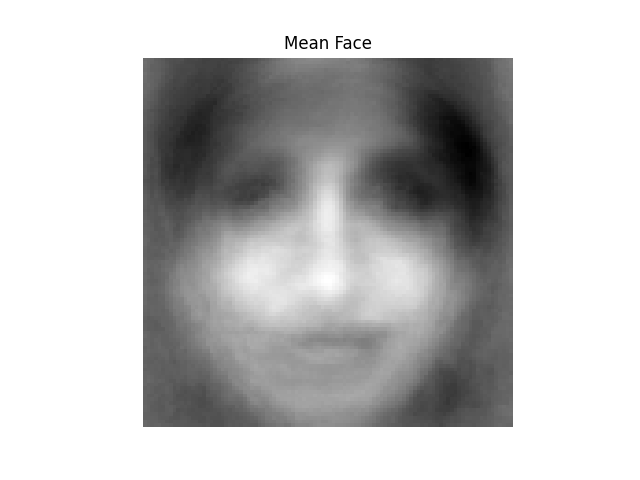
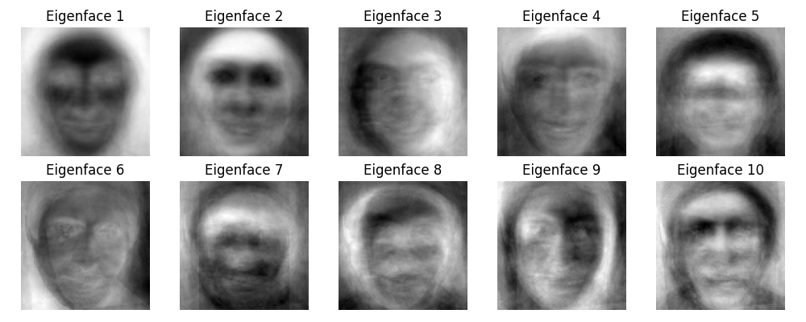
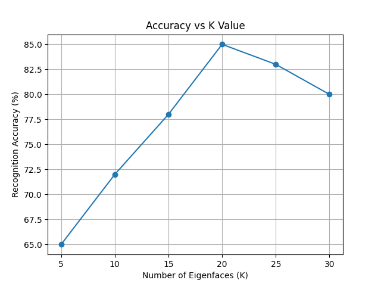

📌 Face Recognition System using PCA and ANN
📖 Project Title

Implementation of Face Recognition using Principal Component Analysis (PCA) and Artificial Neural Network (ANN)

🎯 Aim of the Project

The aim of this project is to design and implement a face recognition system using Principal Component Analysis (PCA) for feature extraction and Artificial Neural Network (ANN) for classification in order to accurately recognize human faces from a given image dataset.

🧠 Project Description

Face recognition is an important application of computer vision and machine learning. In this project, face images are first preprocessed and converted into numerical vectors. PCA is applied to reduce the dimensionality of face images and generate Eigenfaces, which represent the most important facial features. These features are then used to train an Artificial Neural Network (ANN) to classify and recognize different individuals.
The performance of the system is evaluated by changing the number of principal components (K value) and analyzing accuracy.

🛠️ Technologies & Tools Used

Python

NumPy

OpenCV

Matplotlib

Scikit-learn

VS Code

📂 Project Folder Structure
face_recognition/
├── ann.py
├── pca.py
├── train.py
├── accuracy_vs_k.py
├── requirements.txt
├── README.md
├── dataset/
│   └── faces/
│       ├── Aamir/
│       ├── Ajay/
│       ├── Akshay/
│       ├── Alia/
│       └── ...

📊 Dataset Description

The dataset consists of multiple face images.

Each folder represents one person.

Multiple images per person are used for training and testing.

Images are converted to grayscale and resized before processing.

⚙️ Steps Involved

Load face images from the dataset

Convert images into column vectors

Calculate mean face

Perform mean normalization (mean zero)

Apply PCA and generate Eigenfaces

Extract facial features

Train ANN classifier

Test the model and calculate accuracy

Analyze accuracy vs K value

▶️ How to Run the Project
Step 1: Install Dependencies
pip install -r requirements.txt

Step 2: Train and Test the Model
python train.py

Step 3: Plot Accuracy vs K
python accuracy_vs_k.py
✅ Applications

Biometric authentication

Security systems

Attendance systems

Surveillance systems

⚠️ Limitations

Performance depends on image quality

Sensitive to lighting and pose variations

Requires sufficient training images per person

🔚 Conclusion

This project successfully demonstrates a face recognition system using PCA and ANN. PCA effectively reduces dimensionality while preserving important facial features, and ANN provides accurate classification. The system shows good performance and can be extended for real-world applications.

👨‍🎓 Internship Submission

This project is submitted as part of the Internship Studio Internship Program.

📈 Output
## Project Outputs

### Mean Face

### Eigenfaces

### Accuracy vs K

